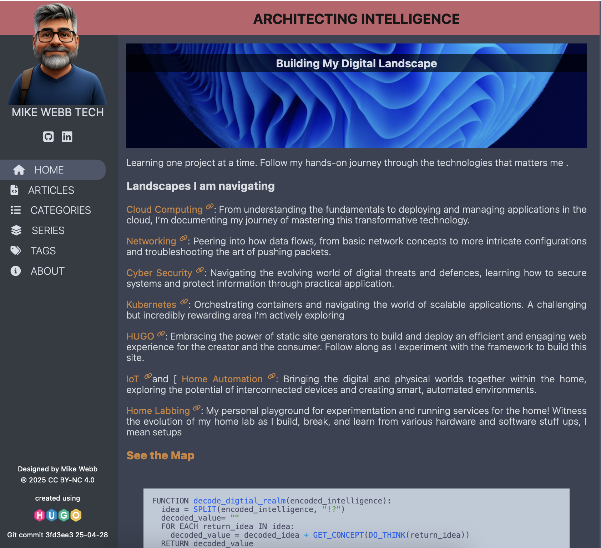

<h1 align="center""> My Hugo Site Theme </h1>
<h3 align="center">Static Site Built using HUGO </h3>

<h4>Table of Contents</h4>

- [hugo](#hugo)
- [progress](#progress)

---

## Hugo

> **QUOTE**
> "The world’s fastest framework for building websites"

Hugo is a static site generator framework written in go and sites are created using html templates with embedded go template language snippets. The content for the site is generated from text files such as markdown, json, asciiDoc etc.

The [hugo documentation](https://gohugo.io/documentation) is extensive and well structured and there is an active community to lean on for help. There are lots of blog articles and theme examples to draw inspiration and get started with creating a site. If an existing theme meets your needs, hugo is even easier and faster to get started with.

**What is a SSG and Why?**
Static site generators offer faster performance, enhanced security, and greater scalability by pre-building web pages as static files rather than generating them on demand using a database backend. This approach simplifies hosting and maintenance, allows for better content version control, and provides a lighter backend with fewer dependencies. As a result, static sites are more reliable, more secure, and often offer better SEO due to their speed.

---

## Progress

Progress is slow, there is a lot about using the hugo framework that is not intuitive, but I am working my way through the [documentation](https://gohugo.io/documentation/) and implementing functionality as learn or driven by want.

### To do list:

- [x] Design site layout and CSS
- [x] Slice up site html template into hugo partials
- [x] Create home page markdown (content/\_index.md)
- [x] Create about page markdown (contnent/about/\_index.md)
- [x] First Hugo template layouts/pages/single.html for home and about page
- [x] Nav bar template with place holders for _home_, _about_, _articles_, _categories_, _series_ and _tags_
- [x] Huge layout/\_default/list.html for list pages (articles, categories, series and tags)
- [x] Articles feature ingesting content/articles/\*.md article files
- [x] Implement _categories_ list page using terms template
- [x] _Category_ feature using terms template and content/categories/category-name/\_index.md leaf bundle
- [x] Create named _categories_, style, add categories list array to articles front matter
- [x] Implement _tags_ and \*tag-name\* list page using terms list template and style
- [x] Add metadata to list page items (in layout/\_default/list.html template)
- [x] Add metadata to article page head (created in layout/page/single.html template)
